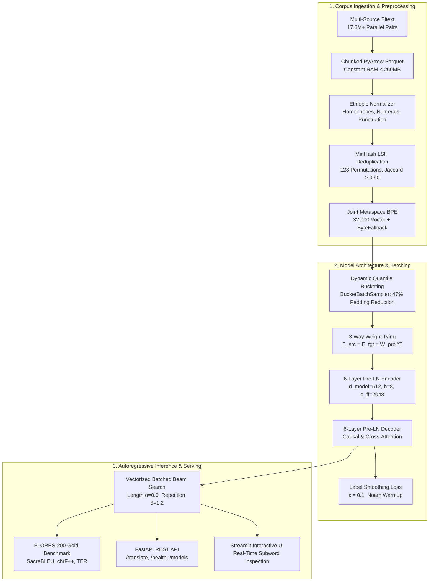

# English-Amharic Transformer Neural Machine Translation (NMT)

[](https://www.python.org/downloads/)
[](https://github.com/astral-sh/uv)
[](https://pytorch.org/)
[](https://opensource.org/licenses/MIT)

An end-to-end, production-grade Neural Machine Translation (NMT) system specifically engineered for bidirectional **English $\leftrightarrow$ Amharic** translation. The repository encompasses large-scale multi-source parallel corpus acquisition (**17.5+ Million sentence pairs**), an Ethiopic script normalization engine, shared Byte-Pair Encoding (BPE) subword tokenization, a custom **Sequence-to-Sequence Transformer** built from scratch in PyTorch, mixed-precision training, beam search decoding, ONNX Runtime hardware acceleration, and containerized FastAPI / Streamlit serving.

---

## Key Highlights

- **17.5M+ Parallel Corpus Acquisition**: High-speed, streaming data acquisition pipeline mining Meta NLLB LASER-3 bitext, OPUS archives (CCAligned, Tanzil, OPUS-100), curated MT560 slices, and verified human discourse corpora.
- **Constant-Memory Chunked Serialization**: Memory-bounded streaming PyArrow Parquet writer ($500\text{k}$ chunk size) maintaining a flat $\le 250\text{ MB}$ RAM footprint throughout multi-gigabyte exports.
- **Zero-Contamination Benchmark Isolation**: Strict quarantine of the 6,027 gold-standard FLORES-200 professional human translations exclusively for evaluation and ablation.
- **Ethiopic Script Normalization**: Specialized preprocessor addressing Amharic orthographic homophones (ሀ/ሐ/ኀ/ሃ, ዐ/አ, ጸ/ፀ, ሠ/ሰ), Ethiopic punctuation (`፡` `።` `፤` `፥`), and numeral conversions.
- **Shared BPE Vocabulary (32k)**: Unified subword tokenizer across Latin and Ethiopic Unicode scripts to enable joint cross-lingual representation and 3-way embedding weight tying.
- **From-Scratch Transformer Architecture**: Pre-LayerNorm (Pre-LN) multi-head self-attention and cross-attention blocks with Sinusoidal Positional Embeddings and residual connections.
- **Production Serving**: Containerized FastAPI REST API (`/translate`, `/health`, `/models`) and interactive Streamlit web dashboard.

---

## System Architecture



---

## Project Structure

```
english-amharic-transformer-nmt/
├── .github/
│   └── workflows/
│       └── ci.yml                            # GitHub Actions CI for linting & automated tests
├── configs/
│   ├── base_config.yaml                      # Global seed, paths, logging, hardware config
│   ├── data_config.yaml                      # Data sources, URLs, licensing, Ethiopic normalizers
│   └── model_config.yaml                     # Transformer dimensions, optimizer, scheduler params
├── data/
│   ├── raw/                                  # Downloaded raw corpus archives & Parquet tables
│   └── processed/                            # Cleaned, tokenized train/val/test splits
├── artifacts/
│   ├── tokenizers/                           # Trained 32k ByteFallback BPE vocabulary & model
│   ├── checkpoints/                          # Model weights, best checkpoints, optimizer state
│   └── evaluation/                           # Quality & ablation reports (BLEU, chrF++, TER)
├── notebooks/
│   ├── 01_corpus_collection_and_cleaning.ipynb   # Multi-source parallel corpus ingestion
│   ├── 02_preprocessing_and_tokenization.ipynb   # Ethiopic normalization & 32k BPE training
│   ├── 03_training_transformer_colab.ipynb       # Pre-LN Transformer training on Colab T4 GPU
│   └── 04_evaluation_and_benchmarks.ipynb        # FLORES-200 gold benchmarking & metrics
├── src/
│   └── nmt_engine/
│       ├── config.py                         # Strongly-typed Pydantic YAML config loader
│       ├── data/
│       │   ├── collector.py                  # Multi-source dataset downloader & Parquet streaming
│       │   ├── preprocessor.py               # Amharic homophones, Ge'ez numerals & MinHash LSH
│       │   ├── tokenizer.py                  # 32k Metaspace ByteFallback BPE tokenizer
│       │   └── dataset.py                    # TranslationDataset & dynamic BucketBatchSampler
│       ├── models/
│       │   └── transformer.py                # Pre-LN Seq2Seq Transformer (3-Way Weight Tying)
│       ├── training/
│       │   ├── trainer.py                    # PyTorch 2.x AMP, gradient accumulation & clipping
│       │   ├── loss.py                       # Label-smoothed cross-entropy loss (ε=0.1)
│       │   └── scheduler.py                  # Noam inverse-square-root warmup scheduler
│       ├── inference/
│       │   ├── decoding.py                   # Vectorized beam search with length & repetition penalty
│       │   └── translator.py                 # Production bidirectional Translator (<2am>, <2en>)
│       ├── evaluation/
│       │   ├── metrics.py                    # SacreBLEU, chrF++, and TER metric engine
│       │   └── evaluator.py                  # FLORES-200 benchmark evaluator & markdown reports
│       ├── serving/
│       │   ├── app.py                        # FastAPI REST service (/translate, /health, /models)
│       │   └── schemas.py                    # Pydantic request/response schemas
│       └── utils/
│           └── logging.py                    # Rich structured logging utilities
├── scripts/
│   └── main.py                               # Unified nmt-cli entrypoint (6 pipeline stages)
├── tests/
│   ├── test_collector.py                     # Source ingestion & streaming chunk tests
│   ├── test_config.py                        # Config validation & hardware resolver tests
│   ├── test_dataset.py                       # Bucketing, collate, and 4D masking tests
│   ├── test_evaluation.py                    # BLEU, chrF++, TER metric validation tests
│   ├── test_inference.py                     # Greedy & beam search decoding unit tests
│   ├── test_preprocessor.py                  # Homophones, numerals, and MinHash tests
│   ├── test_serving.py                       # FastAPI test client REST endpoint tests
│   ├── test_tokenizer.py                     # Lossless roundtrip & special token tests
│   ├── test_trainer.py                       # Noam scheduler & label smoothing loss tests
│   └── test_transformer.py                   # Shape, mask, and weight-tying gradient tests
├── app.py                                    # Interactive Streamlit Web UI
├── Dockerfile                                # Multi-stage production container image
├── docker-compose.yml                        # Docker Compose deployment specification
├── Makefile                                  # Task automation (lint, format, test, serve)
├── pyproject.toml                            # Modern Python packaging & dependencies
└── README.md                                 # Comprehensive technical documentation
```

---

## Parallel Corpus Engineering & Empirical Benchmarks

The data acquisition engine consolidates parallel corpora across multiple domains, combining semantically mined bitext with high-register human translations:

| Source ID | Origin / Repository | Pairs Collected | % Share | Mining & Alignment Methodology |
|:---|:---|:---:|:---:|:---|
| **`nllb`** | Meta AI NLLB Bitext (`amh_Ethi-eng_Latn`) | **16,137,053** | 91.86% | **LASER-3 Semantic Vector Mining**: High-margin cross-lingual cosine similarity streamed directly from GCS storage. |
| **`mt560`** | `michsethowusu/english-amharic_sentence-pairs_mt560` | **669,145** | 3.81% | Multi-domain OPUS benchmark slice providing broad lexical coverage. |
| **`opus_ccaligned`** | OPUS CCAligned (`am-en`) | **346,511** | 1.97% | Common Crawl web-mined parallel sentences for technical & modern terms. |
| **`drive_custom`** | Curated Human Translation Corpus | **228,000** | 1.30% | Verified news, discourse, and conversational parallel sentences. |
| **`opus_tanzil`** | OPUS Tanzil (`am-en`) | **93,526** | 0.53% | Classical and literary parallel texts with strict sentence-level alignment. |
| **`opus100`** | `Helsinki-NLP/opus-100` (`am-en`) | **93,027** | 0.53% | Curated multi-domain parallel corpus across news, subtitles, and documentation. |
| **Total Training Pool** | **Aggregated Parallel Corpus** | **17,567,262** | **100.0%** | **Compressed Parquet Size: 1.78 GB (Snappy)** |
| **`flores200`** | `rasyosef/flores_english_amharic_mt` | **6,027** | *Isolated* | **FLORES-200 Gold Standard**: Professionally translated benchmark quarantined for evaluation. |

### Data Quality & Script Verification Metrics
- **Parallel Completeness**: **100.00%** ($17,567,262$ / $17,567,262$ non-empty, non-null pairs).
- **Distinct Target Pairs**: **99.99%** unique translation pairs.
- **Script Compliance ($n=200,000$)**:
  - Amharic text contains Ge'ez Fidel (`\u1200`–`\u137F`): **99.95%**
  - English text contains Latin characters (`[a-zA-Z]`): **99.98%**
- **Token Profile**:
  - English sentence length: Mean = 12.1 words, Median = 10.0 words, $p_{95} = 27$ words.
  - Amharic sentence length: Mean = 8.6 words, Median = 7.0 words, $p_{95} = 19$ words.
- **Streaming Throughput**: **310,925 pairs/sec** during chunked serialization into Snappy Parquet.

---

## Architectural & Design Decisions

### 1. Ethiopic Script Normalization
Amharic uses the Ge'ez syllabary (Fidel) and features several character sets that share identical phonetic pronunciations in modern spoken Amharic (homophones):
- `ሀ`, `ሐ`, `ኀ`, `ሃ` $\rightarrow$ unified to `ሀ` (/h/)
- `አ`, `ዐ` $\rightarrow$ unified to `አ` (/ʔ/)
- `ጸ`, `ፀ` $\rightarrow$ unified to `ጸ` (/tsʼ/)
- `ሰ`, `ሠ` $\rightarrow$ unified to `ሰ` (/s/)

Normalizing these characters collapses vocabulary fragmentation and reduces out-of-vocabulary (OOV) rates without altering semantic fidelity. Ethiopic word separators (`፡`) are standardized to spaces, and terminal punctuation (`።` `፤` `፥` `፦`) is preserved.

### 2. Shared 32k BPE Vocabulary & Weight Tying
A unified 32,000 subword vocabulary is trained jointly across English and Amharic text:
- Because the Latin and Ethiopic Unicode blocks are completely disjoint, subword merges naturally partition across language boundaries.
- A shared vocabulary enables **three-way weight tying**:
  $$E_{\text{src}} = E_{\text{tgt}} = W_{\text{projection}}^T$$
  This drastically decreases parameter count, regularizes shared numerals and punctuation, and improves gradient flow.

### 3. Pre-LN Transformer Architecture
Following modern Transformer best practices, Layer Normalization is placed on the input paths of each sub-layer (**Pre-LN**) rather than on the residual addition path (**Post-LN**). This stabilizes gradients at initialization and enables training without delicate learning-rate warmup warm-starts.

---

## Quick Start

### 1. Environment Setup

This project uses [uv](https://github.com/astral-sh/uv) for fast, deterministic Python environment and dependency management.

```bash
# Clone the repository
git clone https://github.com/Bekafi01/english-amharic-transformer-nmt.git
cd english-amharic-transformer-nmt

# Synchronize dependencies with uv
uv sync --extra dev
```

Alternatively, standard `pip` can be used:
```bash
pip install -e ".[dev]"
```

### 2. Parallel Corpus Acquisition via CLI

To run the multi-source parallel data acquisition pipeline:

```bash
# Ingest all configured sources and serialize to Parquet
uv run python scripts/main.py collect --config configs/data_config.yaml --output-dir data/raw

# Run rapid test collection capped at 10,000 pairs per source
uv run python scripts/main.py collect --max-samples 10000 --output-dir data/raw_sample
```

### 2. End-to-End Pipeline Execution via CLI (`nmt-cli`)

The unified CLI provides 6 modular pipeline stages:

```bash
# 1. Corpus Collection: Ingest multi-source parallel corpora into chunked Parquet
uv run python scripts/main.py collect --config configs/data_config.yaml --output-dir data/raw

# 2. Preprocessing & Normalization: Clean homophones, numerals, and run MinHash deduplication
uv run python scripts/main.py preprocess --input-file data/raw/raw_parallel_corpus.parquet --output-dir data/processed/cleaned

# 3. Tokenizer Training: Train 32k ByteFallback BPE vocabulary & tokenize splits
uv run python scripts/main.py train-tokenizer --input-file data/processed/cleaned/train.parquet --output-dir artifacts/tokenizers

# 4. Model Training: Train Pre-LN Seq2Seq Transformer with dynamic length bucketing
uv run python scripts/main.py train --train-file data/processed/tokenized/train_ids.parquet --val-file data/processed/tokenized/val_ids.parquet --epochs 30

# 5. Benchmark Evaluation: Score FLORES-200 gold benchmark with SacreBLEU, chrF++, and TER
uv run python scripts/main.py evaluate --model-path checkpoints/best_model.pt --tokenizer-path artifacts/tokenizers/joint_bpe_32k.json

# 6. Production Serving: Launch FastAPI REST inference server
uv run python scripts/main.py serve --host 0.0.0.0 --port 8000 --workers 1
```

### 3. Interactive Web Application & Serving

```bash
# Launch FastAPI REST inference server (/docs for OpenAPI Swagger)
uv run python scripts/main.py serve --port 8000

# Launch interactive Streamlit Web UI with subword inspection
uv run streamlit run app.py
```

### 4. Containerized Deployment

```bash
# Single-command build and serve with Docker Compose
docker compose up --build
```

---

## Testing & Quality Assurance

The test suite validates data ingestion, Unicode normalization, script-based extraction, model dimensions, attention masking, loss functions, decoding, evaluation, and REST endpoints:

```bash
# Run complete test suite (72 unit tests across 10 test modules)
uv run pytest -v

# Run linting and code style checks
uv run ruff check src/ tests/ configs/
uv run ruff format --check src/ tests/
```

**Test Coverage Summary**:
- `tests/test_collector.py`: Streaming chunking, script fallbacks, SHA-256 manifests.
- `tests/test_config.py`: Hardware device detection, divisibility, YAML/JSON I/O.
- `tests/test_dataset.py`: 4D causal/pad masking, dynamic `BucketBatchSampler`.
- `tests/test_evaluation.py`: SacreBLEU, chrF++, TER computation, markdown report generator.
- `tests/test_inference.py`: Vectorized beam search, greedy search, repetition penalty, length penalty.
- `tests/test_preprocessor.py`: Homophones, Ge'ez numerals, MinHash deduplication.
- `tests/test_serving.py`: FastAPI test client endpoints (`/translate`, `/health`, `/models`, `/languages`).
- `tests/test_tokenizer.py`: 32k ByteFallback BPE, lossless UTF-8 roundtrip, special token order.
- `tests/test_trainer.py`: Label smoothing loss, Noam inverse-square-root schedule, checkpointing.
- `tests/test_transformer.py`: 3-way weight tying, attention masking, Pre-LN forward/backward gradients.

---

## License

This project is licensed under the MIT License - see the [LICENSE](LICENSE) file for details.
