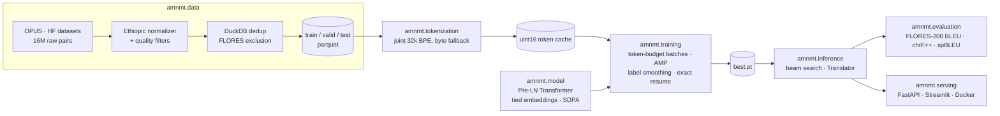
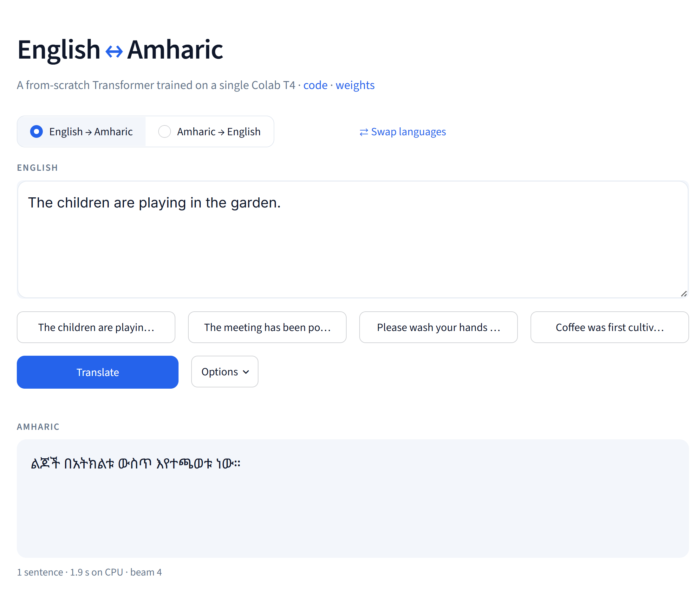

# English ↔ Amharic Transformer NMT

[](https://github.com/Bekafi01/english-amharic-transformer-nmt/actions/workflows/ci.yml)
[](https://www.python.org/downloads/)
[](https://pytorch.org/)
[](LICENSE)
[](https://english-amharic-nmt.streamlit.app)
[](https://huggingface.co/Bekafi/amnmt-en-am-base)

A from-scratch PyTorch Transformer for bidirectional English–Amharic translation, built as a
layered Python package with one CLI. One 60M-parameter model handles both directions via a
target-language tag; it was trained on 4.4M filtered sentence pairs in 15 GPU-hours on a free
Colab T4 and reaches **14.5 BLEU / 37.7 chrF++ (en→am)** and **24.4 BLEU / 49.3 chrF++ (am→en)**
on FLORES-200 devtest. Heavy stages (corpus build, training) run on Colab/Kaggle; everything is
reproducible from the YAML configs in `configs/`.


```mermaid
flowchart LR
    subgraph Data["amnmt.data"]
        SRC["OPUS · HF datasets<br/>16M raw pairs"] --> NORM["Ethiopic normalizer<br/>+ quality filters"]
        NORM --> DEDUP["DuckDB dedup<br/>FLORES exclusion"]
        DEDUP --> PQ[("train / valid / test<br/>parquet")]
    end
    PQ --> TOK["amnmt.tokenization<br/>joint 32k BPE, byte fallback"]
    TOK --> CACHE[("uint16 token cache")]
    CACHE --> TRAIN["amnmt.training<br/>token-budget batches · AMP<br/>label smoothing · exact resume"]
    MODEL["amnmt.model<br/>Pre-LN Transformer<br/>tied embeddings · SDPA"] --> TRAIN
    TRAIN --> CKPT[("best.pt")]
    CKPT --> INF["amnmt.inference<br/>beam search · Translator"]
    INF --> EVAL["amnmt.evaluation<br/>FLORES-200 BLEU · chrF++ · spBLEU"]
    INF --> SERVE["amnmt.serving<br/>FastAPI · Streamlit · Docker"]
```

## Setup

```bash
uv sync --all-extras --group dev
uv run amnmt --help
make check      # ruff + import-linter + mypy + pytest
```

## Pipeline

| Stage        | Command                                                                               | Output                                                                              |
| ------------ | ------------------------------------------------------------------------------------- | ----------------------------------------------------------------------------------- |
| Corpus build | `amnmt data build -c configs/full.yaml [--root DIR] [--raw-dir DIR]`                  | `data/processed/full/{train,train_holdout,valid,test}.parquet`, `data_card.json`    |
| Tokenizer    | `amnmt tokenizer train -c configs/full.yaml [--root DIR]`                             | `artifacts/full/tokenizer/{tokenizer.json,stats.json}`                              |
| Training     | `amnmt train -c configs/full.yaml [--root DIR] --run NAME --resume --time-limit MIN`  | `artifacts/full/runs/NAME/{last.pt,best.pt,metrics.jsonl}`                          |
| Translate    | `amnmt translate -m best.pt -d en-am "text" [--beam 4]`                               | stdout                                                                              |
| Evaluation   | `amnmt eval -m best.pt -c configs/full.yaml [--root DIR] --split test [--spbleu]`     | `runs/NAME/eval_test_beam4.{json,md}` (BLEU, chrF++, spBLEU, both directions)       |
| Export       | `amnmt export -m best.pt -o bundle/ [--fp16]`                                         | `bundle/{model.pt,tokenizer.json,export.json}` — inference-only, ~120 MB, Hub-ready |
| Serving      | `amnmt serve -m best.pt [--port 8000]` · `streamlit run app.py` · `docker compose up` | REST `POST /translate`, `GET /health`, OpenAPI at `/docs`; Streamlit UI on :8501    |

`configs/tiny.yaml` runs the same pipeline on a few thousand pairs and must always work.

### Try the trained model

Live demo: [english-amharic-nmt.streamlit.app](https://english-amharic-nmt.streamlit.app) (Streamlit Community Cloud, free tier —
may take a minute to wake) ·
Weights: [Bekafi/amnmt-en-am-base](https://huggingface.co/Bekafi/amnmt-en-am-base) (CC-BY-NC-4.0).

[](https://english-amharic-nmt.streamlit.app)

```bash
pip install "amnmt[tokenization,hub] @ git+https://github.com/Bekafi01/english-amharic-transformer-nmt.git"
amnmt translate -m hf://Bekafi/amnmt-en-am-base -d en-am "Coffee originated in Ethiopia."
```

```python
from amnmt.inference.translator import Translator

tr = Translator.from_checkpoint("hf://Bekafi/amnmt-en-am-base")
tr.translate(["The children are playing in the garden."], "en-am")
```

Any `-m` / `AMNMT_CHECKPOINT` that accepts a path also accepts `hf://<repo>[@<revision>]`, so the
REST API and Docker image can run straight from the Hub. The hosted demo is `demo/app.py`; Streamlit
Community Cloud deploys it from this repo via the root `streamlit_app.py` shim and installs
dependencies with `uv sync` from `uv.lock` (the `demo` dependency group and the Linux CPU-torch
index in `pyproject.toml` exist for that).

### Reproducing the full model on Colab / Kaggle

Every stage is idempotent and resumable, so the sequence below can be spread over as many
sessions as needed. `ROOT` is a persistent folder (Drive); `RAW` is fast local disk for downloads.

```bash
git clone https://github.com/Bekafi01/english-amharic-transformer-nmt.git repo && cd repo
pip install -q -e ".[data,tokenization,evaluation]"
ROOT=/content/drive/MyDrive/amnmt; RAW=/content/raw

# 1. Corpus: ~1 GB download, 16M pairs streamed → 15M clean pairs           (CPU, ~50 min)
amnmt data build -c configs/full.yaml --root $ROOT --raw-dir $RAW
# 2. Tokenizer: 32k joint BPE from a 2M-sentence/language sample              (CPU, ~4 min)
amnmt tokenizer train -c configs/full.yaml --root $ROOT
# 3. Training: first call tokenizes the subset into a cache (~8 min), then trains.
#    Re-run the same line in each new session; it resumes from last.pt.      (T4, ~15 h total)
amnmt train -c configs/full.yaml --root $ROOT --run base_medium --resume --time-limit 690
# 4. Evaluation on FLORES-200 devtest, both directions                        (T4, ~5 min)
amnmt eval -m $ROOT/artifacts/full/runs/base_medium/best.pt -c configs/full.yaml --root $ROOT --spbleu
# 5. Use it
amnmt translate -m $ROOT/artifacts/full/runs/base_medium/best.pt -d en-am "Coffee originated in Ethiopia."
```

Outputs land under `$ROOT/{data/processed/full, artifacts/full/{tokenizer,cache,runs/base_medium}}`.
The data build skips sources whose shard already exists; training checkpoints every 2,000 steps
and restores model, optimizer, LR schedule, sampler position and RNG state exactly.

## Data

All training sources are public. `valid`/`test` are FLORES-200 dev/devtest (official tarball) and
are excluded from training by a normalized-key match on both sides.

| Source                 | Pairs (raw) | License        | Origin                                                                                                                                       |
| ---------------------- | ----------- | -------------- | -------------------------------------------------------------------------------------------------------------------------------------------- |
| MT560 (en–am slice)    | 669k        | CC-BY-4.0      | [HF: michsethowusu/english-amharic_sentence-pairs_mt560](https://huggingface.co/datasets/michsethowusu/english-amharic_sentence-pairs_mt560) |
| OPUS-100 `am-en`       | 89k         | mixed (OPUS)   | [HF: Helsinki-NLP/opus-100](https://huggingface.co/datasets/Helsinki-NLP/opus-100)                                                           |
| Tanzil                 | ~100k       | Tanzil         | [OPUS](https://opus.nlpl.eu/Tanzil.php)                                                                                                      |
| CCAligned              | ~350k       | CC (web crawl) | [OPUS](https://opus.nlpl.eu/CCAligned.php)                                                                                                   |
| NLLB (LASER-mined)     | ~16M        | CC-BY-NC-4.0   | [OPUS](https://opus.nlpl.eu/NLLB.php)                                                                                                        |
| FLORES-200 (eval only) | 997 + 1012  | CC-BY-SA-4.0   | [Meta](https://github.com/facebookresearch/flores/tree/main/flores200)                                                                       |

Preprocessing (`amnmt.data`): NFC, Ethiopic homophone folding, Ge'ez numerals → digits, wordspace
`፡` → space, Moses detokenization, then length/ratio/script-share/URL/markup filters and exact
dedup on a normalized key. Per-source keep/reject counts are written to `data_card.json`.

Tokenizer (`amnmt.tokenization`): one joint 32k BPE for both languages (HF `tokenizers`), Metaspace
word split, isolated punctuation, individual digits, byte fallback (no `<unk>` ever). Specials:
`<pad>=0 <s>=1 </s>=2 <unk>=3 <2am>=4 <2en>=5`. Trained on a seeded reservoir sample of the
score-filtered training subset.

## Results

`configs/full.yaml` — Transformer-base (60.5M params, 6+6 layers, d=512, tied 32k BPE), one
bidirectional model trained on the _medium_ subset (4.43M pairs: all curated sources + NLLB pairs
with LASER score ≥ 1.068) for 54k steps (7 epochs, ≈ 15 GPU-hours on a Colab T4, fp16, 8k tokens × 3
accumulation) until FLORES dev loss plateaued. Scores on **FLORES-200 devtest** (1,012 sentences),
beam 4, sacreBLEU 2.6:

| direction | BLEU  | chrF++ | spBLEU |
| --------- | ----- | ------ | ------ |
| en → am   | 14.51 | 37.74  | 28.36  |
| am → en   | 24.39 | 49.27  | 24.95  |

BLEU is `13a`-tokenized; spBLEU uses the `flores200` SentencePiece tokenizer. Hypotheses are
scored against references normalized the same way as the training data (homophone folding etc.);
against the raw references en→am BLEU is 12.24 — the cost of folding, which a production model
should avoid (`normalize.fold_homophones: false`). Greedy decoding is about 1 BLEU lower in each
direction.

Training curve (FLORES dev perplexity): 176 @ 2k steps → 14.4 @ 8k → 8.9 @ 26k → 8.1 @ 44k →
7.9 @ 54k (plateau). Sample output of the final model:

|       | input                                    | output                                           |
| ----- | ---------------------------------------- | ------------------------------------------------ |
| en→am | The children are playing in the garden.  | ልጆች በአትክልቱ ውስጥ እየተጫወቱ ነው።                        |
| en→am | Please close the door quietly.           | እባክዎን በሩን በጸጥታ ያጥፍ።                              |
| am→en | ልጆቹ በአትክልት ስፍራ ውስጥ እየተጫወቱ ነው።            | The kids are playing in the garden.              |
| am→en | Chelsy Cross የእኋን ግሩም ፍቃደኛ ሰራተኞች አንዱ ነው! | Chelsy Cross is one of our excellent volunteers! |

The trained checkpoint (`best.pt`, 700 MB) is not in the repository; the fp16 inference export
(~120 MB) is on the Hub at [Bekafi/amnmt-en-am-base](https://huggingface.co/Bekafi/amnmt-en-am-base).

## Design

**Layered package, enforced.** `core ← data ← tokenization ← model ← training ← inference ←
evaluation ← serving ← cli`. A layer may import only downward; `import-linter` fails CI otherwise.
The model layer is pure `torch.nn` (no file I/O, no YAML, no tokenizer) and is verified against
`torch.nn.Transformer` with copied weights to 1e-5.

**Scale ladder.** Every stage runs on `configs/tiny.yaml` in minutes on a CPU (the tests do this)
before touching `configs/full.yaml`. Same code path; only the numbers change.

**Built for interrupted compute.** Corpus shards, the token cache, and checkpoints live on Drive;
every stage is idempotent. A resumed training run reproduces an uninterrupted one bit-for-bit
(tested) — the final model was trained across four Colab sessions.

| decision                                             | why                                                              | measured trade-off                                                        |
| ---------------------------------------------------- | ---------------------------------------------------------------- | ------------------------------------------------------------------------- |
| One bidirectional model with `<2am>`/`<2en>` tags    | halves training and serving cost; encoder sees Amharic both ways | —                                                                         |
| Top-quartile NLLB pairs by LASER score (4.4M of 15M) | 3× shorter epochs; converged in 7                                | train loss flat since 44k → data-saturated at this model size             |
| Fold Amharic homophones (ሐ/ኀ→ሀ, ሠ→ሰ, ዐ→አ, ፀ→ጸ)       | removes spelling variance the model cannot learn                 | **−2.3 BLEU en→am against raw references**; train unfolded for production |
| Beam 4, GNMT length penalty, no KV cache             | simple and correct                                               | +1 BLEU over greedy at 3× the decode time                                 |
| fp16 + GradScaler on T4 (bf16 only on sm_80+)        | T4 "supports" bf16 only by emulation                             | 20k target tok/s, zero overflow events in 15 h                            |

## Layout

```
src/amnmt/
├── core/          config (pydantic), logging
├── data/          sources, normalize, filters, flores, pipeline
├── tokenization/  joint BPE
├── model/         Transformer (pure torch.nn)
├── training/      dataset, loss, scheduler, trainer
├── inference/     greedy / beam search, Translator
├── evaluation/    FLORES-200 BLEU / chrF++
├── serving/       FastAPI
└── cli.py         `amnmt` entrypoint
```

Layers may only import downward; `import-linter` enforces this in CI.

## Development

```bash
make check                                    # ruff + import-linter + mypy + pytest (128 tests, ~40 s)
uv run amnmt data build -c configs/tiny.yaml  # tiny end-to-end on CPU (~1 min, ~70 MB download)
uv run amnmt tokenizer train -c configs/tiny.yaml
uv run amnmt train -c configs/tiny.yaml       # 300 steps, ~1 min
```

## License

MIT — see [LICENSE](LICENSE). Data licenses are listed per source above; the NLLB mined bitext is
CC-BY-NC-4.0, so a model trained on it inherits the non-commercial restriction.
